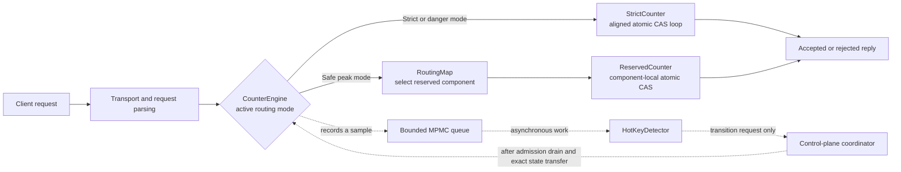
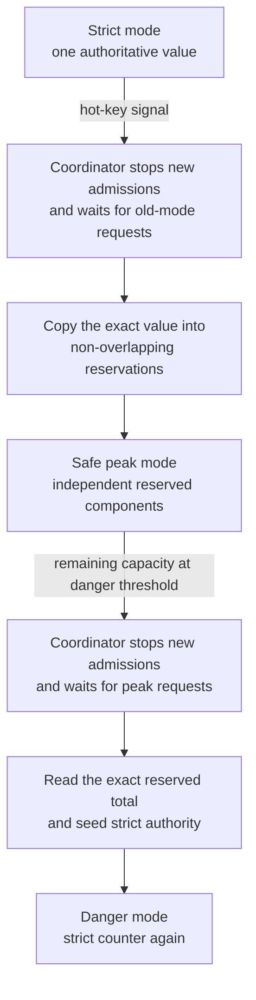
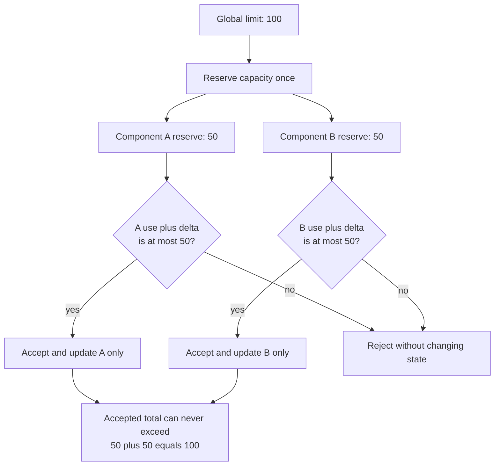

# Hot Counter PoC

A C++20 proof of concept for a **bounded financial counter** that must remain
correct when one logical counter becomes hot. The project explores a clean path
from a strict, single-authority counter to a safe reservation-based peak mode.
It is intentionally explicit about what it proves and what still needs
production validation.

> **Status:** production-oriented PoC, not a production deployment. The core
> counter invariants are tested; automatic distributed transition, replication,
> failover, authentication, observability, and a DPDK data plane remain future
> work.

## The problem, in plain language

Imagine an account with a daily spending limit of 1,000. A client asks to add
an amount `delta`. The operation must be atomic:

```text
INCRNCHK(counter, delta, limit)

if current + delta <= limit:
    store current + delta
    return ACCEPTED
else:
    leave current unchanged
    return REJECTED
```

“Atomic” means that even if thousands of requests arrive at the same moment,
the result must be identical to some valid one-at-a-time ordering. The total
must never exceed the limit. This is stronger than a normal Redis `INCR`:
`INCR` has no built-in maximum and does not implement a variable-delta
check-and-increment contract.

## What the PoC demonstrates

On the AWS `t3.micro` PoC environment, 32 persistent clients completed about
70K operations per second against one logical counter:

| Workload | Completed TPS | p99 latency | Contract |
| --- | ---: | ---: | --- |
| Redis 6.2, one hot key | 68.6K | 0.519 ms | `INCR` only |
| C++ strict mode | 69.9K | 0.679 ms | atomic delta + hard limit |
| C++ safe-peak mode, 3 reservations | 69.9K | 0.592 ms | hard global cap; may false-reject under skew |

These are capability results, **not** a direct latency comparison: Redis used
loopback while the C++ server used the private VPC network. The C++ test was
rate-capped at 70K TPS, so it does not prove 100K+ TPS or linear multi-node
scaling.

## Repository layout

```text
.
├── cpp/                         # Canonical C++20 implementation
│   ├── include/counter_poc/      # Public domain abstractions
│   ├── src/                     # Counter, routing, control-plane code
│   ├── server/                  # Reference POSIX/TCP daemon
│   ├── tests/                   # Deterministic correctness tests
│   └── dpdk/                    # DPDK host/deployment contract
├── src/, benchmark/, tests/     # Earlier C harness kept for comparison
├── scripts/                     # Simple local C-harness commands
└── .github/workflows/ci.yml     # Build-and-test workflow
```

The C++ directory is the source of truth for the design. The C code is not a
second production implementation; it is retained to reproduce the early
benchmark phases.

## Architecture



### Safe mode changes



The hot-key detector is deliberately asynchronous and lossy. It must never
block the data plane. A dropped sample can delay a scaling decision, but it
cannot make an accepted transaction unsafe.

The arrows labelled “Coordinator” are intentionally **not** automatic data
plane operations. Publishing a mode before all old-mode requests have drained
could double-count or lose an update. The current C++ library raises transition
requests; a future coordinator must make the drain, state transfer, and route
publication transactional.

### 1. Strict mode

`StrictCounter` owns one aligned `std::atomic<uint64_t>`. Its CAS loop first
checks `delta <= limit - current`, which also avoids unsigned integer overflow.
Only a successful compare-and-swap changes the value. Therefore no accepted
operation can take the counter above its limit.

Strict mode has the strongest semantics and is used at normal load and in the
danger zone. Its drawback is contention: many cores repeatedly update one
cache line for the same hot logical key.

### 2. Safe peak mode: capacity reservations

When a counter is hot, its remaining capacity can be divided in advance among
several independent internal components. For a limit of 100 split across two
components, each component may receive a reserve of 50. A component accepts
only if its own local use stays within its reserve.

Because the reserves are non-overlapping and add up to the global limit, the
global limit cannot be exceeded. This is an **escrow** or **bounded-counter**
idea, not “eventual consistency.”



The trade-off is a possible **false rejection**: component A can run out while
component B still has unused reserve. Rebalancing capacity is control-plane
work and must preserve the same ownership invariant.

### 3. Danger mode

Near the limit, preserving every possible acceptance is usually more valuable
than minimizing contention. The coordinator requests a return to strict mode
when remaining capacity reaches the configured danger threshold (for example,
100,000). It must first stop new admissions for that counter, wait for
in-flight old-mode operations, copy the exact value, and only then publish the
new route. The library intentionally does **not** make this unsafe transition
automatically.

### Why a CRDT alone is not enough

`GCounter` shows the merge rule for a grow-only counter: each replica keeps a
component and replicas merge by taking the per-component maximum. That makes
updates converge eventually, but separate replicas can each accept an update
without knowing the other did so. A plain CRDT therefore cannot enforce a hard
financial maximum. The reservation rule, or a coordinating authority, is
required for safety.

## Core C++ abstractions

| Type | Responsibility | Extension point |
| --- | --- | --- |
| `ICounter` | Minimal counter contract | Add another safe local-counter strategy |
| `StrictCounter` | Linearizable CAS implementation | Change persistence / replication behind the interface |
| `ReservedCounter` | Non-overlapping escrow capacity | Add safe reservation rebalancing |
| `RoutingMap` | Atomically publishes the data-plane mode | Replace with a versioned distributed routing map |
| `HotKeyDetector` | Bounded asynchronous hot-key signals | Use eBPF, NIC counters, or sampled telemetry |
| `CounterEngine` | Composes modes and transition requests | Add an authenticated coordinator API |
| `ITransport` | Transport seam | Plug in an epoll, io_uring, or DPDK transport |

The fast path allocates no memory, takes no mutex, and uses bounded work. The
reservation and strict implementations use acquire/release CAS operations
instead of a global lock. The provided TCP daemon is a reference transport;
production use should use bounded worker ownership, per-core queues, request
limits, TLS/authentication, and backpressure.

## Build and test

Requirements: a C++20 compiler, `make`, and POSIX sockets (Linux or macOS).

```sh
make -C cpp clean all
make -C cpp test
```

The correctness suite covers:

- strict variable-delta acceptance and rejection;
- concurrent strict updates without exceeding the limit;
- reservation safety and expected false-rejection behaviour;
- G-Counter merge convergence; and
- strict → reserved → danger transitions after quiescence.

Build the earlier C benchmark harness only when needed:

```sh
make legacy-c
make legacy-test
```

## Run the reference daemon

```sh
# port limit internal-shards danger-threshold hot-key-threshold-tps [peak]
./cpp/build/counterd 9091 1000000000000000 3 100000 50000

# Start directly in the safe-peak state for a controlled experiment.
./cpp/build/counterd 9091 1000000000000000 3 100000 50000 peak
```

The line protocol is deliberately small for benchmark transparency: send one
unsigned decimal delta followed by `\\n`; receive `A\\n` for accepted or `R\\n`
for rejected. The reference daemon currently addresses one logical counter.
An application transport should carry an authenticated counter identifier,
idempotency key, tenant context, deadline, and tracing metadata.

## Reproducing the 70K offered-load test

Use separate client and server instances. Build the C harness and run its
offered-rate benchmark against the C++ daemon:

```sh
make legacy-c
./build/offered-benchmark <server-private-ip> 9091 32 15 70000 1
```

Use a large enough limit that rejection does not affect saturation data. Then
run a finite-limit scenario separately to validate reject behaviour and the
danger-mode transition request.

## DPDK / RSS deployment boundary

This repository does **not** claim a working DPDK data plane. The current
transport is kernel TCP. Before claiming kernel-bypass performance, use an
instance with ENA support and a dedicated secondary data-plane ENI, preserve a
management ENI for SSH, verify IOMMU/vfio and huge pages, configure RSS queues
to match pinned worker cores, and prove packet forwarding with `testpmd`.
See [`cpp/dpdk/README.md`](cpp/dpdk/README.md) for the deployment contract.

## Production readiness checklist

Before using this for money, limits, inventory, or entitlements, add and test:

1. durable replicated state and recovery semantics;
2. authenticated, versioned requests plus idempotency keys;
3. a transactional admission-drain transition coordinator;
4. safe reservation movement and lease/fencing rules;
5. deterministic multi-node failure, partition, and restart tests;
6. per-counter quotas, backpressure, overload shedding, and observability;
7. a fair same-network saturation benchmark against the chosen Redis setup;
8. fuzzing, sanitizers, and continuous load testing; and
9. a DPDK/RSS implementation and packet-rate proof on the intended instance
   family.

## Contributing

Keep the invariant visible in both code and tests: **an accepted operation may
never make the logical counter exceed its limit**. Any new routing or
replication strategy must describe how it preserves that statement during
normal operation, transitions, retries, failures, and recovery.
